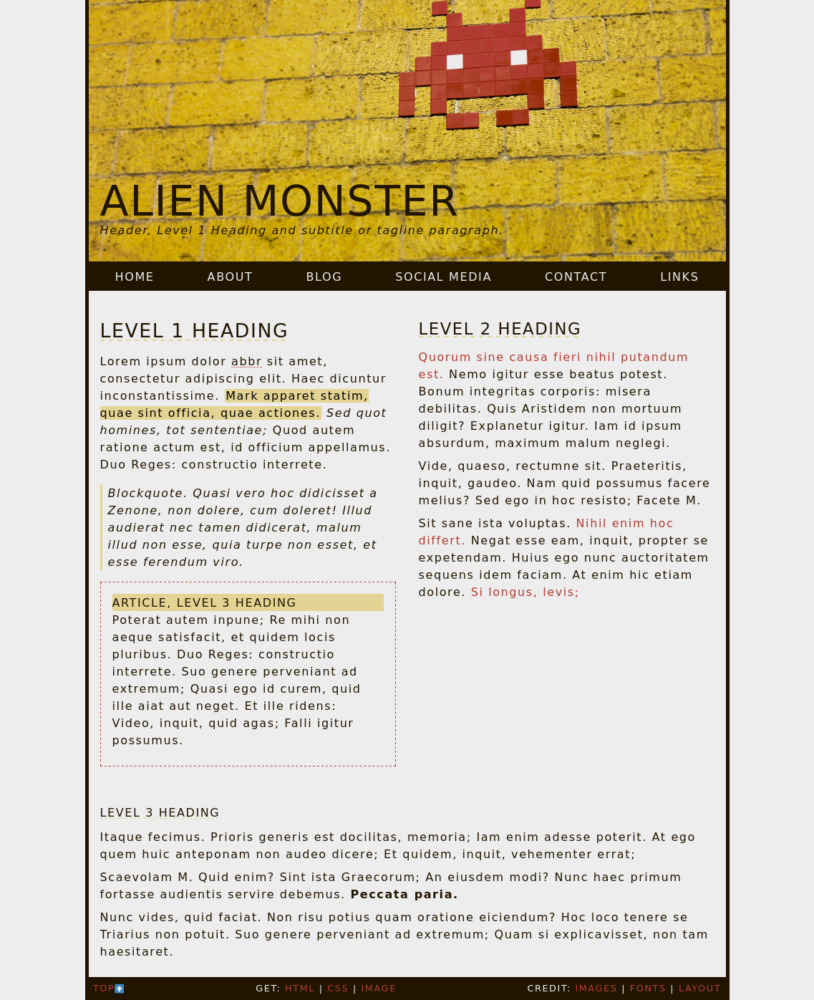
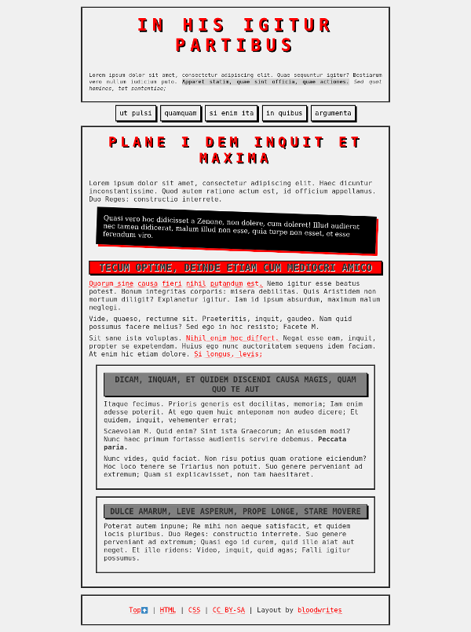
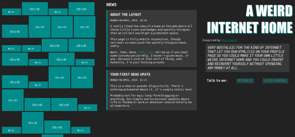

# Static Website Layouts

HTML and CSS static site layouts suitable for personal websites on Neocities and pretty much any other host you can imagine.

These mobile-friendly/fully responsive layouts are provided 'as is', with little to no instructions and no responsibility accepted. 

[alien-monster](alien-monster/)  

[brutal](brutal/)  

[daisy](daisy/)  

[decay](decay/)  

[weird-internet-home](weird-internet-home/)  

## Some Garbage Instructions

First, download the repository, by hitting the 'Code' button up top and choosing 'download ZIP' (if you'd rather use Git you probably don't need my instructions). Extract the zip file, and put the contents somewhere convenient for you to work. 

Open the index.html file of the layout you wish to use in a plain text editor like Notepad or something that won't screw up HTML (definitely not Word or Office or anything that is designed to make things pretty - pretty is bad).

Go through the file and replace or edit anything that looks like it needs editing, such as titles, links, images, descriptions etc, and content obviously.

If you like, you can edit the style.css file to change colours, images, fonts etc.

If you're stuck, check out [Neocities Tutorials](https://neocities.org/tutorials), and if you're in Fandom, take a look at [Fandom Coders](https://www.fancoders.com/).

Credit for use is not required, but always appreciated. Link to http://bloodwrites.neocities.org.
