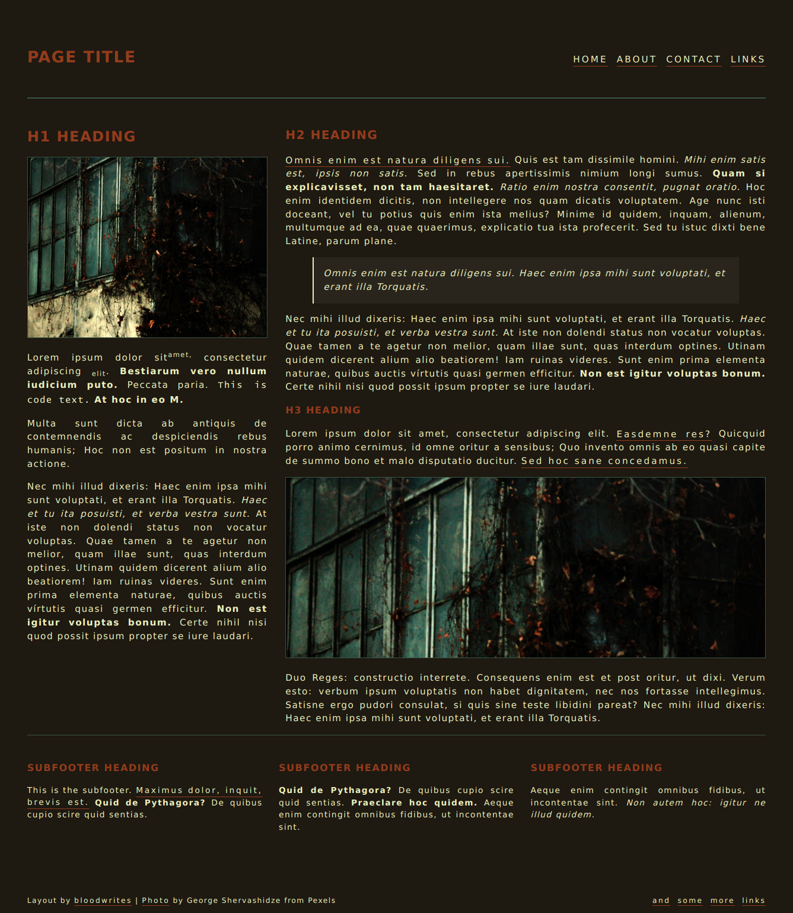

# Decay Layout

This layout is provided 'as is', with garbage instructions and no responsibility accepted. 

Mobile-friendly/fully responsive. 

### Layout Colours

**Text:** primary-colour: #ECF0BD (cream)  
**Background:** background-colour: #1E1911 (brown)  
**Link underlines and headings:** secondary-colour   #943C1C (orange)  
**Link background and borders:** tertiary-colour: #375543 (green)

### Layout Fonts

**Headings:** Verdana web safe font stack  
**Body:** Verdana web safe font stack

## Some Garbage Instructions

First, download the layout package, by hitting the 'Code' button up top and choosing 'download ZIP' (if you'd rather use Git you probably don't need my instructions). Extract the zip file, and put the contents somewhere convenient for you to work. 

Open the index.html file in a plain text editor like Notepad or something that won't screw up HTML (definitely not Word or Office or anything that is designed to make things pretty - pretty is bad).

Go through the file and replace or edit anything that looks like it needs editing, such as titles, links, images, descriptions etc, and content obviously.

The basic structure of the page is made up of HTML tags as follows:

`<header></header>`  
`<nav></nav>`  
`<section></section>`  
`<footer></footer>`

You're going to want to throw your content within the `<section></section>` tags. There are two in the `<main>` part of the page, and three sections with the class 'subfooter' below the main.

Edit your links in `<nav>` and in the `<footer>`, and you're away! Have fun!

If you want to switch the colours, open the style.css file and edit the :root section (near the top of the file). Good luck.

Likewise if you wish to switch the fonts.

If you're stuck, check out [Neocities Tutorials](https://neocities.org/tutorials), and if you're in Fandom, take a look at [Fandom Coders](https://www.fancoders.com/).

Credit for use is not required, but always appreciated. Link to http://bloodwrites.neocities.org for the layout. The background image was found on [Pexels](https://www.pexels.com).
